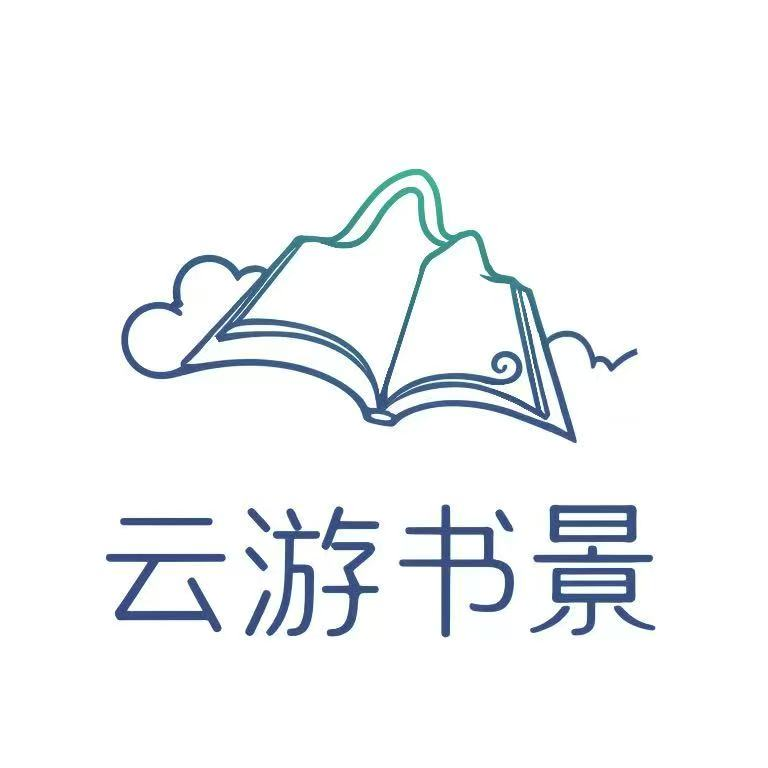

<html lang="zh">
<head>
  <meta charset="UTF-8" />
  <meta name="viewport" content="width=device-width, initial-scale=1.0" />
  <title>云游书景文创集</title>
  
</head>
<body>

  <header>
    
    <nav>
      <a href="#about">关于我们</a>
      <a href="#team">团队介绍</a>
      <a href="#products">文创产品</a>
      <a href="#contact">联系我们</a>
    </nav>
  </header>

  <section class="company" id="company">
  

    <h2>公司介绍</h2>
    

      云游书景传媒有限公司是一家专注于"文化+旅游+数字内容"创新融合的现代传媒企业。
      公司以经典教材、文学名著、艺术名画为内容载体，通过
      "跟着名作去旅行"的核心产品理念，打造线上线下相结合的文旅新业态。
    

    <h3>核心业务模式：</h3>
    <ul>
      <li>1. <strong>数字内容生产：</strong>将经典作品中的场景进行影视化再现，制作高品质的短视频、纪录片及图文内容</li>
      <li>2. <strong>新媒体矩阵运营：</strong>构建抖音、小红书、B站等多平台自媒体矩阵，实现文化内容的精准传播</li>
      <li>3. <strong>文创产品开发：</strong>基于IP内容衍生开发"云游书景"系列文创产品，拓展商业变现渠道</li>
    </ul>
    

      公司致力于通过现代传媒技术，让经典文化以更生动的方式走进大众生活，
      推动文旅产业的内容升级与价值创新。
    

  

</section>

<section id="team" class="team-section">
  

    <h2 class="section-title">核心团队介绍</h2>
    

      <h3><i class="fas fa-building"></i> 公司简介</h3>
      
云游书景传媒有限公司是一家专注于"文化+旅游+数字内容"创新融合的现代传媒企业。公司以经典教材、文学名著、艺术名画为内容载体，通过"跟着名作去旅行"的核心产品理念，打造线上线下相结合的文旅新业态。

      <h3><i class="fas fa-rocket"></i> 核心业务模式</h3>
      <ol>
        <li><strong>数字内容生产：</strong>将经典作品中的场景进行影视化再现，制作高品质的短视频、纪录片及图文内容</li>
        <li><strong>新媒体矩阵运营：</strong>构建抖音、小红书、B站等多平台自媒体矩阵，实现文化内容的精准传播</li>
        <li><strong>文创产品开发：</strong>基于IP内容衍生开发"云游书景"系列文创产品，拓展商业变现渠道</li>
      </ol>

      <h3><i class="fas fa-users"></i> 核心团队构成</h3>
      
云游书景汇聚了一支多学科融合的专业团队，成员来自汉语言文学、汉语国际教育、网络与新媒体、教育技术、财务会计教育、市场营销、环境艺术与设计、美术学、统计学等九大专业领域，共同构建"文化+旅游+数字媒体"的创新生态。

      <ul>
        <li><strong>① 内容创作中心：</strong>
          汉语言文学团队负责经典文本深度解读，汉语国际教育团队提供跨文化传播视角，美术学与环境艺术设计团队主导视觉艺术呈现。
        </li>
        <li><strong>② 数字媒体中心：</strong>
          网络与新媒体团队负责全媒体内容策划与平台运营，教育技术团队开发沉浸式数字体验产品，统计学团队提供数据分析支持。
        </li>
        <li><strong>③ 商业运营中心：</strong>
          市场营销团队制定推广策略，财务会计团队优化商业模型与成本控制。
        </li>
      </ul>

      <h3><i class="fas fa-lightbulb"></i> 团队优势</h3>
      <ul>
        <li>✅ 文化内涵的学术性保障</li>
        <li>🎨 视觉呈现的艺术性表达</li>
        <li>💻 数字传播的技术性支撑</li>
        <li>📈 商业运营的科学性管理</li>
      </ul>

      
这支复合型团队将持续以专业能力推动文化创意产业的创新发展。

    

    <a href="javascript:void(0);" id="toggleBtn">展开更多</a>
  

</section>

  <section class="section" id="products">
    <h2>文创产品</h2>
    

      <!-- 千里江山图系列 -->
      

        
        
千里江山图钥匙扣

      

      

        
        
千里江山图冰箱贴

      

      

        
        
千里江山图透卡

      

      

        
        
千里江山图帆布袋

      

      

        
        
千里江山图书签

      

      <!-- 红楼梦系列 -->
      

        
        
红楼梦钥匙扣

      

      

        
        
红楼梦冰箱贴

      

      

        
        
红楼梦透卡

      

      

        
        
红楼梦徽章

      

      

        
        
红楼梦便利贴

      

      <!-- 我与地坛系列 -->
      

        
        
我与地坛明信片

      

      

        
        
我与地坛邮票

      

      

        
        
我与地坛贴纸

      

      

        
        
我与地坛胶片拍立得

      

      

        
        
我与地坛木质挂件

      

      

        
        
我与地坛帆布包

      

    

  </section>

  <section class="section" id="contact">
    <h2>联系我们</h2>
    
联系电话：17817964305

    

      
      
    

  </section>

</body>
</html>
